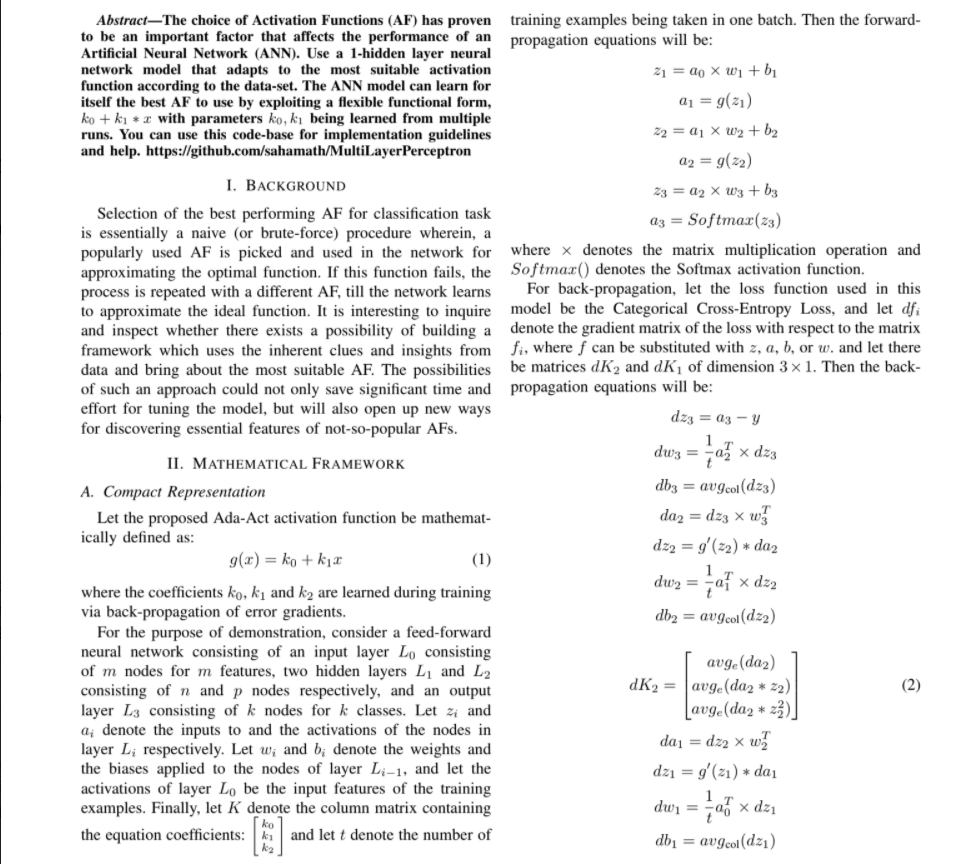

# Self-learning-Linear-Activation-Functions
This repo is implementation of Linear Activation Function for which the weight and biases get updated through gradient descent.
[MNIST (digits)](https://www.kaggle.com/c/digit-recognizer/data?select=train.csv) The data files train.csv and test.csv contain grey-scale images of hand-drawn digits, from zero through nine.
Activation function :- g(x) = k0  + k1x 

